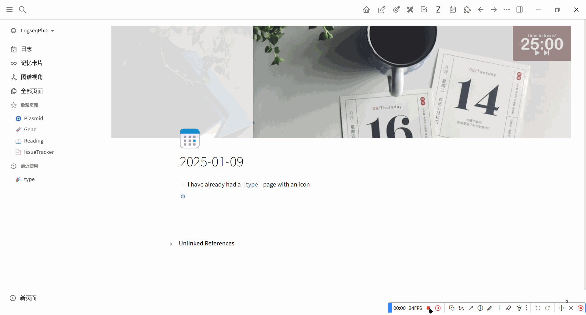

# AutoClass for logseq
> If you find this plugin helpful and would like to support me, you can [buy me a coffee](https://buymeacoffee.com/jwangl5).

## Why this plugin? 🥴
When I use bidirectional links in Logseq, the class or type of each page is crucial for organizing my data structure. Previously, I used prefixes to label different classes. For example: `@+citation key` for papers, `&+number` for issues to be solved. However, as my database grew, I needed more and more characters to label these classes, which became a nightmare to manage.
To address this, I started using the page property class to label this information. While this improved the situation, it was still a bit troublesome because I had to interrupt my workflow to manually add these tags while reading and writing.
That's why I decided to develop this plugin to **automatically add the class property**.
PS: I have already tried using supertags in the database version, but the problem persisted.
## How to use? 🤔

Note: You can use query `{{query (property class [[YourClassName]])}}` to show all the pages in this class.
## Features 🎉
    - Automatically create a page (e.g., `pageA`) and add a class property (e.g., `typeA`) when typing `[[pageA@typeA]]`.
    - Replace the input `[[pageA@typeA]]` with `[[pageA]]` automatically.
    - Inherit the icon information for `[[pageA]]` if `[[typeA]]` has an icon.
## Acknowledgments
Special thanks to ChatGPT for assisting me, as I’m completely new to TypeScript and JavaScript.
